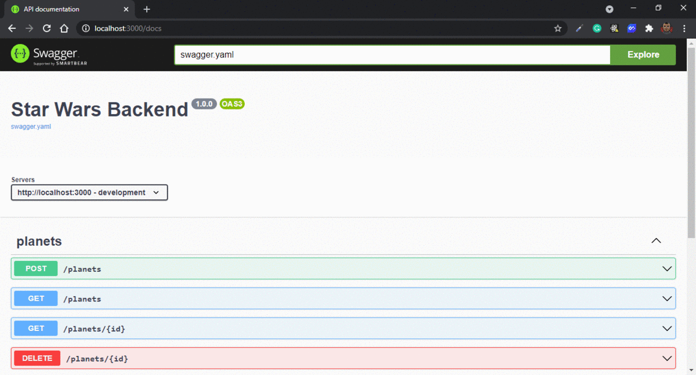

<h1 align="center">
  Star Wars Backend
</h1>

<p align="center">
  <a href="#rocket-project">Project</a>&nbsp;&nbsp;&nbsp;|&nbsp;&nbsp;&nbsp;
  <a href="#computer-techs">Techs</a>&nbsp;&nbsp;&nbsp;|&nbsp;&nbsp;&nbsp;
  <a href="#thinking-how-to-use">How to use</a>&nbsp;&nbsp;&nbsp;|&nbsp;&nbsp;&nbsp;
  <a href="#memo-license">License</a>
</p>

## :rocket: Project

:star2: Star Wars Backend

### Preview

<p align="center">

</p>

### Functionalities

[x] Add planet

[x] List planets

[x] Get planet by name

[x] Get planet by id

[x] Remove planet

## :computer: Techs

- go
- gorilla/mux
- go-OpenAPI
- mongo-driver

## :thinking: How to use

```sh
git clone git@github.com:flaviogf/star_wars_backend.git

cd star_wars_backend

docker-compose up --build -d

# It's running at http://localhost:3000/docs
```

## :memo: License

This project contains the MIT license. See the file [LICENSE](LICENSE).
